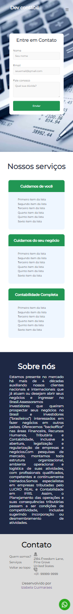
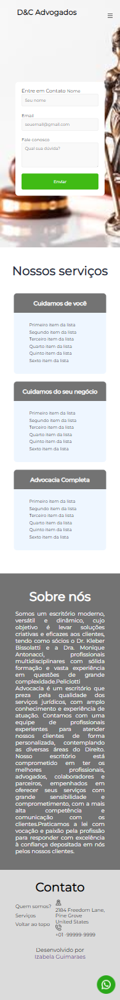

# Landing-page-project

<h3>Final result:</h3>
 

 
 

<h4><a href="https://izabela-guimaraes.github.io/Landing-page-project/" target="blank">Click here to see the application working</a></h4>

<h4>to see another project click here <a href="https://github.com/izabela-guimaraes/PlayStation-Store" target="blank">click here</a></h4>

🚀 Technologies
This project was developed with the following technologies:
 

-html
 
-css
 
-JavaScript

## 🤝  Contributors

We thank the following people who contributed to this project:

<table>
  <tr>
    <td align="center">
      <a href="#">
         
        
          <b>Izabela Guimarães</b>
        
      </a>
    </td>
        <td align="center">
      <a href="#">
        
         
        
          <b>Code Club</b>
        
      </a>
    </td>
</table>

 

